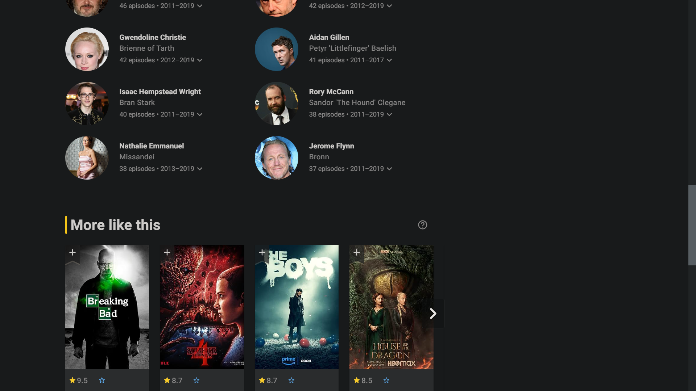
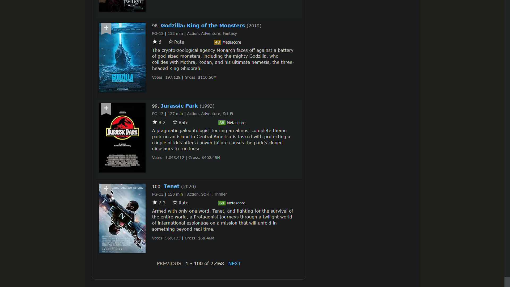

# IMDB Clean as Fuck

Hate the _promotions, interviews, celebrity news, awards, exclusives_ and etc... etc... on IMDB? Then this Ublock orgin filter is for you.

This is basically IMDB with just Movies and TV shows and nothing else.

</br>

👉 **[CLICK ME](https://subscribe.adblockplus.org/?location=https://tetrax-10.github.io/imdb-clean-as-fuck/imdb-clean-as-fuck-with-better-styles.txt&title=IMDB%20Clean%20as%20Fuck)** to Install the filter list with better styles (Recommended)

(or)

👉 **[CLICK ME](https://subscribe.adblockplus.org/?location=https://tetrax-10.github.io/imdb-clean-as-fuck/imdb-clean-as-fuck.txt&title=IMDB%20Clean%20as%20Fuck)** to Install the filter list alone (Removes bloat but no extra styling)

<hr>

### Difference

<table>
  <tr align="center">
    <td>Stock IMDB</td>
     <td>IMDB with filter</td>
  </tr>
  <tr>
    <td></td>
    <td></td>
  </tr>
  <tr>
    <td></td>
    <td></td>
  </tr>
  <tr>
    <td></td>
    <td></td>
  </tr>
  <tr>
    <td></td>
    <td></td>
  </tr>
  <tr>
    <td></td>
    <td></td>
  </tr>
  <tr>
    <td></td>
    <td></td>
  </tr>
  <tr>
    <td></td>
    <td></td>
  </tr>
  <tr>
    <td></td>
    <td></td>
  </tr>
  <tr>
    <td></td>
    <td></td>
  </tr>
  <tr>
    <td></td>
    <td></td>
  </tr>
 </table>

</br>

### FAQ

1. #### How to unhide something?

    - Go to this [page](https://tetrax-10.github.io/imdb-clean-as-fuck/imdb-clean-as-fuck.txt) and search for the element you want to unhide, eg: `metascore`
    - Copy the filter that just below the line you found, eg: `imdb.com##ul[data-testid="reviewContent-all-reviews"]`
    - Paste that in your `Ublock Orgin => Dashboard => My filters`
    - Now replace the doube `##` which is blue in color to `#@#`. Now they should turn green. Some filter might have `###` still you only need to replace the first `##` don't worry about the third `#`
    - Click `Apply changes` on top, thats it you should see the element on the website after a reload.

    #### Frequently whitelisted elements:

    <details>
    <summary>show all</summary>

    - ##### Watch on:

    ```css
      imdb.com#@#.gbsbQW
      m.imdb.com#@#.iCWOBC
    ```

    - ##### Metascore:

    ```css
      imdb.com#@#ul[data-testid="reviewContent-all-reviews"]
    ```

    - ##### Storyline:

    ```css
      imdb.com#@#section[data-testid="Storyline"]
    ```

    - ##### User reviews:

    ```css
      imdb.com#@#section[data-testid="UserReviews"]
    ```

    - ##### Did you know:

    ```css
      imdb.com#@#section[data-testid="DidYouKnow"]
    ```

    - ##### video section:

    ```css
      imdb.com#@#section[data-testid="videos-section"]
    ```

    </details>

2. #### Does this filter block ads?

    No, Ublock Orgin will take care of that. This filter just hides elements that are not important or releated to Movies and TV shows.

3. #### Does this work on mobile version of IMDB?

    Yes, just install [Firefox](https://play.google.com/store/apps/details?id=org.mozilla.firefox) or [Kiwi](https://play.google.com/store/apps/details?id=com.kiwibrowser.browser) browser on android and install Ublock Orgin and this filter

<br>

### Contribution

Seeing something thats not related to Movies or TV shows? Please create an [issue](https://github.com/Tetrax-10/imdb-clean-as-fuck/issues/new/choose) or make a [pull request](https://github.com/Tetrax-10/imdb-clean-as-fuck/pulls) with proper comments and screenshots.

</br>
